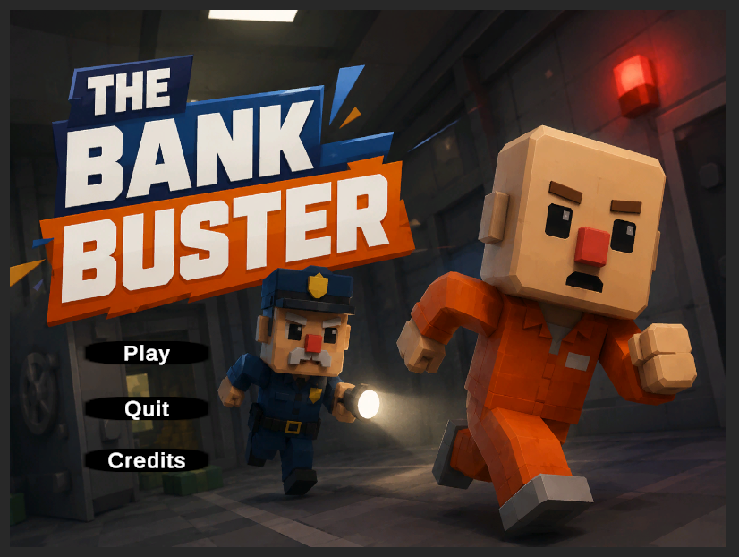
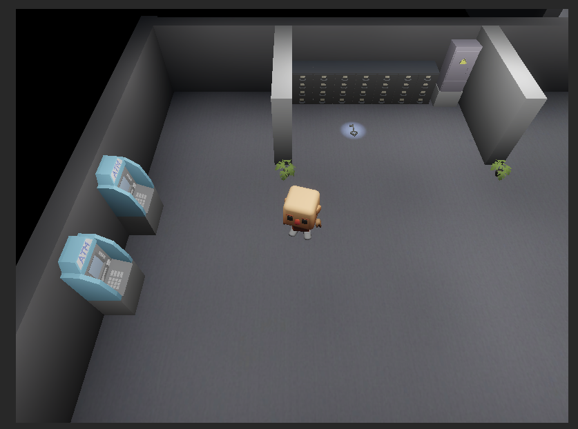
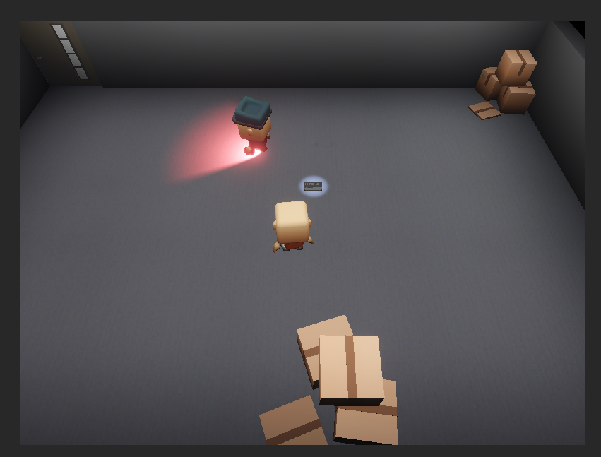
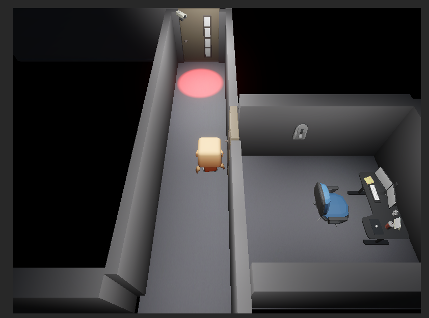
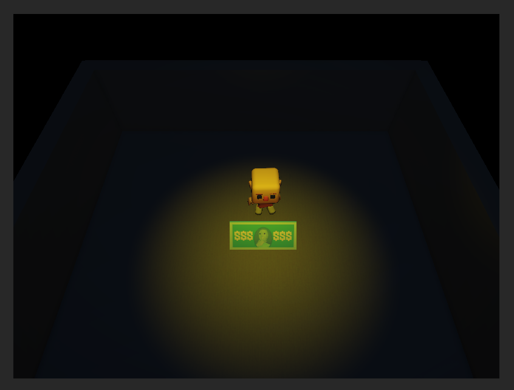

# The-Bank-Buster

A short stealth-heist game built in Unity where the player infiltrates a bank, avoids guards, cameras, and lasers, unlocks doors, and reaches the vault.

## Features

* Guard detection system
* Laser obstacle system
* Key and locked door mechanics
* Elevator keycard system
* Dialogue system with typewriter effect
* Pause menu and game over system
* Audio system
* Room lighting system
* Main menu and credits scene
* WebGL deployment

## Controls

* **WASD** → Move
* **Mouse** → Look Around
* **E** → Interact
* **ESC** → Pause

## Built With

* **Unity**
* **C#**

## Screenshots

